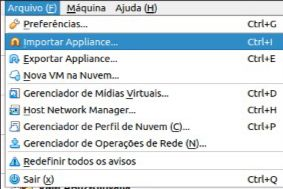
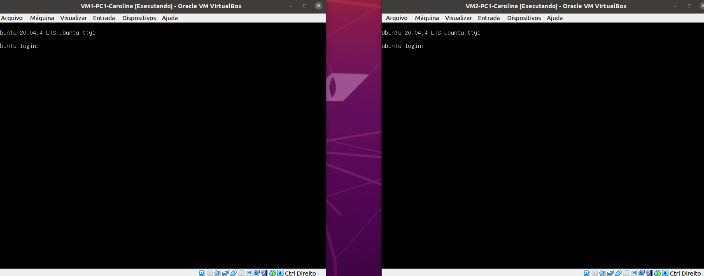
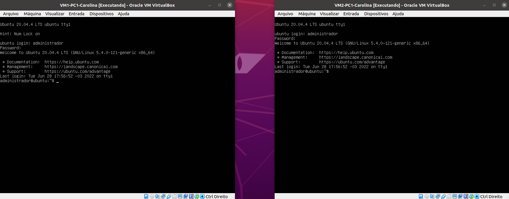
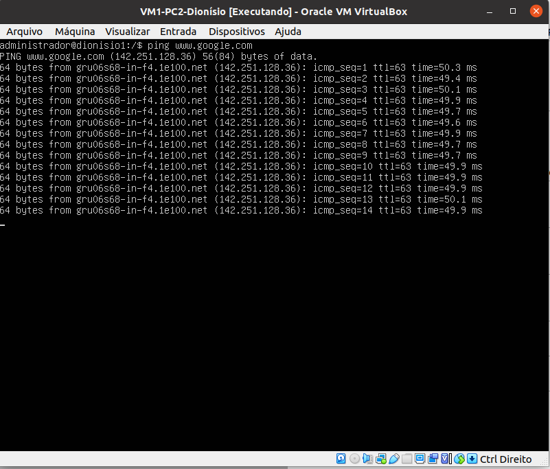
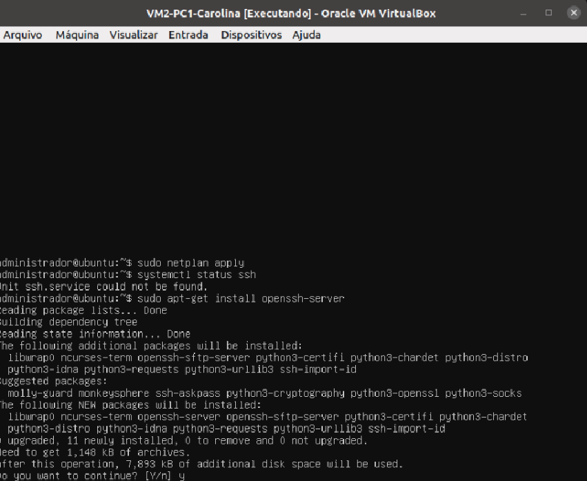

# Projeto 2º Bimestre das disciplinas de Infraestrutura e Serviços de Redes (PRIR/SRED e ISRE)

## 1 - Importando VMs no VirtualBox
  * Importe o arquivo .OVA para criar duas VMs
  
  * A Figura 1 Ilustra as configurações para a importação das VMs: VM-LAB01 e VM-LAB02

    <div align="center">
  <p>Figura 1: Criando uma VM apartir de um arquivo OVA</p>
  
  
  <br><br>
   </div>


   > OBS: apos fazer a importação do arquivo .OVA, **abra as VMs e faça o login**

   <div align="center">
  <p>Figura 2 - Abra as duas máquinas virtuais criadas</p>
  
  <br><br>
   </div>

   * Usuário da VM: `administrador`
   * Senha da VM: `adminifal` 

    <div align="center">
  <p>Figura 2 - Abra as duas máquinas virtuais criadas</p>
  
  <br><br>
   </div>

  * Após fazer o login, **INSTALE** o pacote Net Tools nas VMs
  ```bash
  sudo apt install net-tools -y
  ```
  <br><br>

## 2 - Conectando a máquina à internet

- Caso a máquina não esteja conectada à internet, siga os passos: 
  - Confira se as máquinas estão utilizando o Adaptador1 no modo NAT 

- Teste se suas máquinas estão conectadas à internet com o comando

```bash
$ ping www.google.com
```
<div align="center">
  <p>Figura 3 - Verificando o conexão de internet com o comando ping</p>
  
  <br><br>
</div>

## 3 - Instalando o SSH Server

```bash
$ sudo apt-get install openssh-server
```

- Digite "Y" para confirmar a instalação como no exemplo a seguir

<div align="center">
  <p>Figura 4 - Instalação do SSH Server</p>
  
  <br><br>
</div>

- Verifique o status do ssh para saber se a instalação foi concluída com sucesso

```bash
$ systemctl status ssh
```

<div align="center">
  <p>Figura 5 - Status do SSH Server</p>
  
  <br><br>
</div>

> ## <a href="./3.md">Próxima etapa<a/>