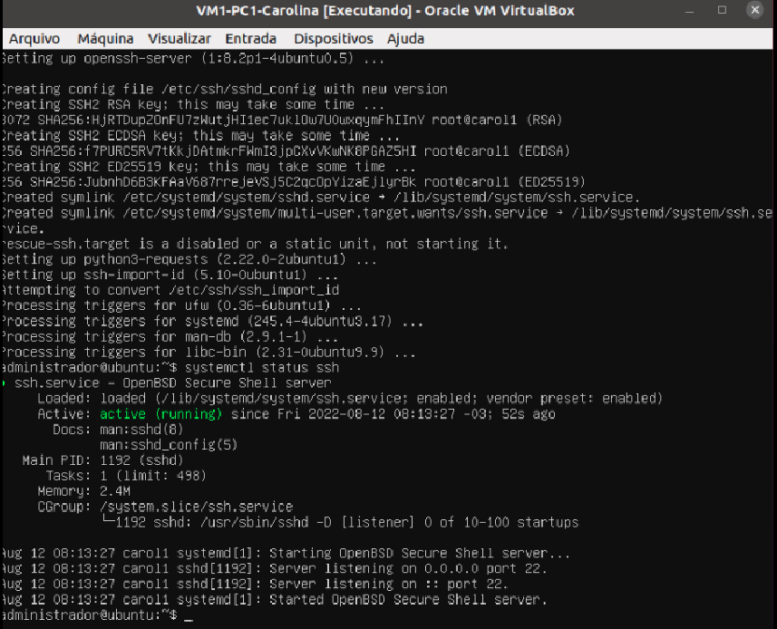
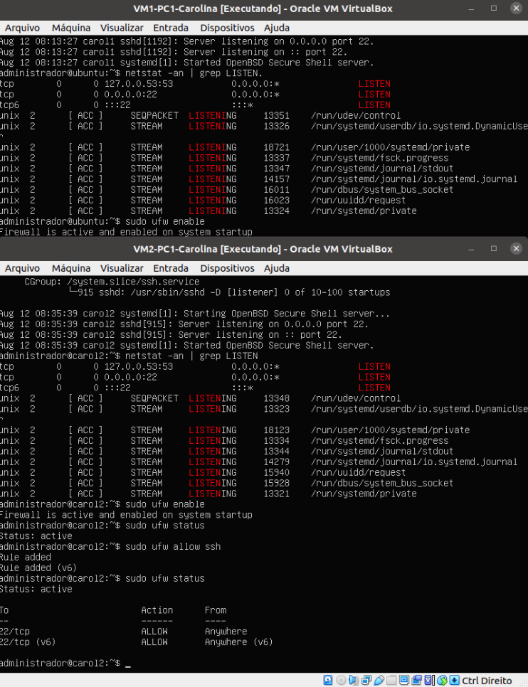
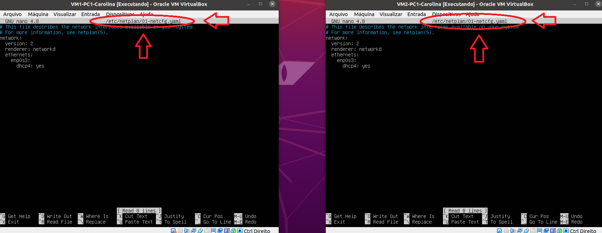
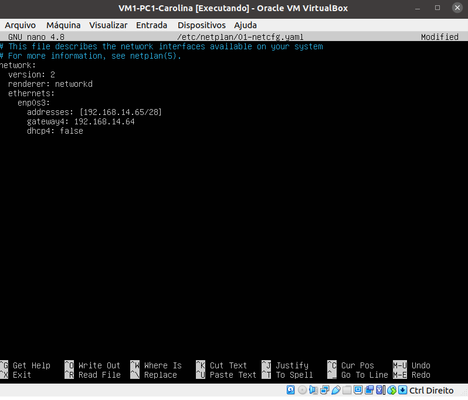
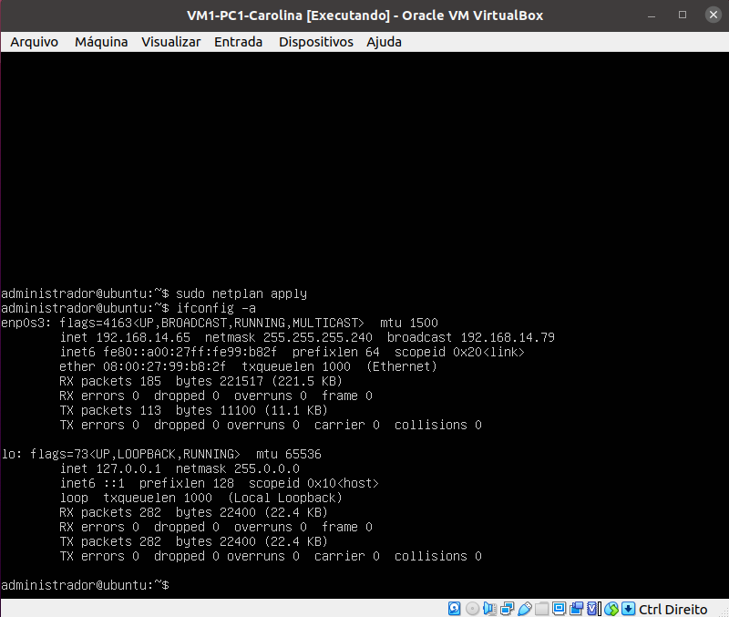
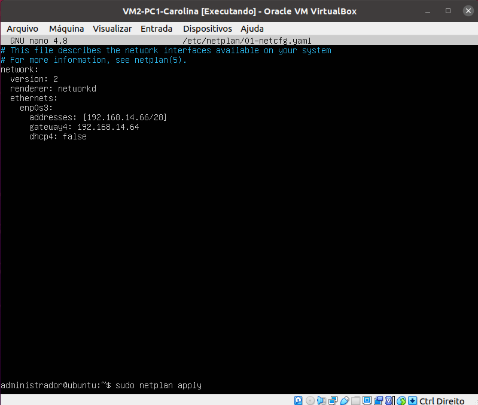
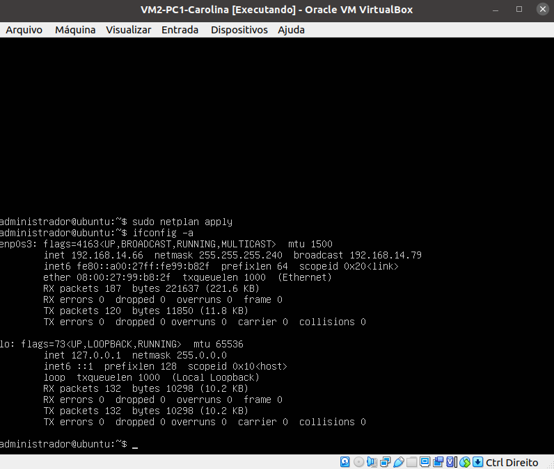
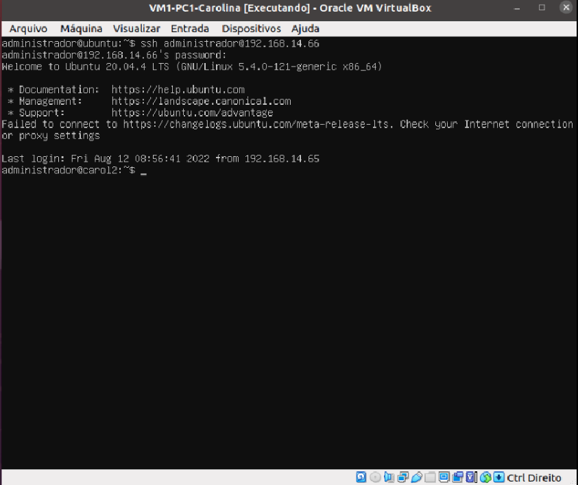
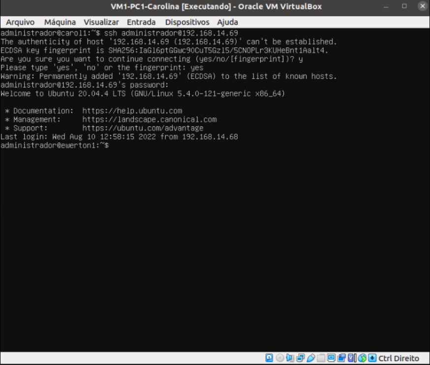

# Roteiro: Acesso remoto em outras máquinas

## 1 - Verifique a instalação do SSH

- Verifique o status do ssh para saber se a instalação foi concluída com sucesso
- Caso o SSH Server não esteja instalado, <a href="./2.md"> confira os passos anteriores <a/>

```bash
$ systemctl status ssh
```

<div align="center">
  <p>Figura 1 - Status do SSH Server</p>
  
  <br><br>
</div>

## 2 - Configurando o Firewall

- Permita a conexão remota via protocolo SSH na porta 22, utilizando o comando

```bash
$ sudo ufw allow ssh.
```

- Ative o firewall

```bash
$ sudo ufw enable
```

<div align="center">
  <p>Figura 2 - Ativação do firewall</p>
  
  <br><br>
</div>

## 3 - Configuração estática de endereço IP na interface de rede

### Passo 1 - Acesse as interfaces de rede

- Para configurar a interface, o ubuntu usa o arquivo YAML
- Digite o comando `ls -la /etc/netplan/` para verificar o nome correto do arquivo no seu servidor.
  > **/etc/netplan/** é a pasta onde o arquivo se encontra
- No exemplo abaixo, foi utilizado o arquivo _01-netcfg.yaml_
  

### Passo 2 - Edite o arquivo

- Para editar o arquivo, digite o comando abaixo:

```bash
$ sudo nano /etc/netplan/01-netcfg.yaml
```

  

### Na VM-PC1

- Após a criação da tabela de Ip's, foi utilizado o IP da Carolina no exemplo: `192.168.14.65`

```bash
network:
  version: 2
  renderer: networkd
  ethernets:
    enp0s3:
      addresses:[192.168.14.65/28]
      gateway4: 192.168.14.64
      dhcp4: false
```

 <br>

- Digite `Ctrl + X` para salvar e sair do ambiente de edição do arquivo.

- Após as alterações feitas, digite eo comando **netplan apply** para aplicar as configurações. Depois, veja a configuração das interfaces com o comando **ifconfig -a**

```bash
$ sudo netplan apply
$ ifconfig -a
```

  

### Na VM-PC2

- Após a criação da tabela de Ip's, foi utilizado o IP da Carolina no exemplo: `192.168.14.66`

```bash
network:
  version: 2
  renderer: networkd
  ethernets:
    enp0s3:
      addresses:[192.168.14.66/28]
      gateway4: 192.168.14.64
      dhcp4: false
```

   
  
  * Digite `Ctrl + X` para salvar e sair do ambiente de edição do arquivo.
  
  * Após as alterações feitas, digite eo comando **netplan apply** para aplicar as configurações. Depois, veja a configuração das interfaces com o comando **ifconfig -a**

```bash
$ sudo netplan apply
$ ifconfig -a
```

  
  
  ### Passo 3 - Colocar em modo bridge
   * Após conectar os cabos Ethernet nos PCs, configure a placa de rede para modo Bridge.
   
   

<br>
<section id="ssh"> </section>

## 4 - Acessando uma máquina remotamente

- Utilize o comando $ ssh `<usuario>`@`<ip.do.servidor.remoto>` para acessar remotamente uma outra máquina

<div align="center">
  <p>Figura 7 - Acessando máquinas remotamente pelo ssh server</p>
  
  <br><br>
</div>

## 5 - Acessando remotamente a máquina de um computador externo

- <a href="#ssh">Acesse a máquina desejada seguindo os passos de conexão com SSH</a>

<div align="center">
  <p>Figura 8 - Acessando uma máquina de outro computador via cabo de rede</p>
  
  <br><br>
</div>

> ## <a href="./5.md">Próxima etapa</a>
