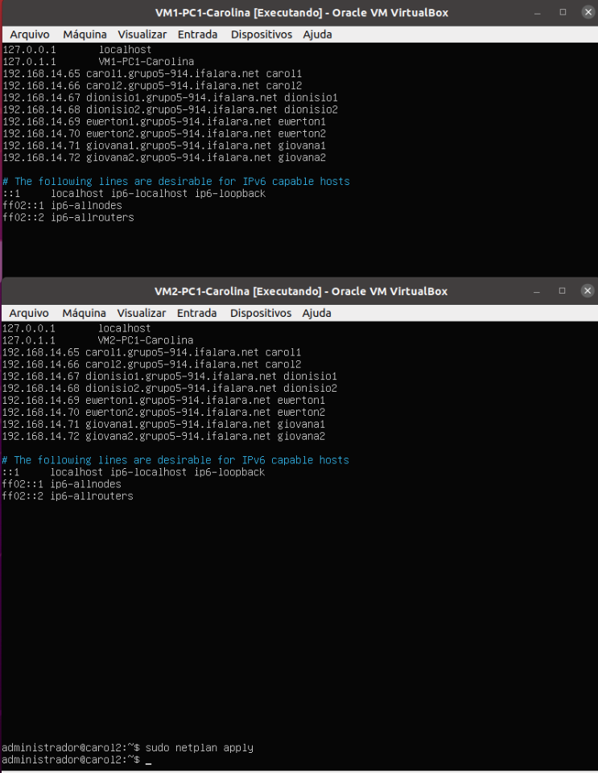
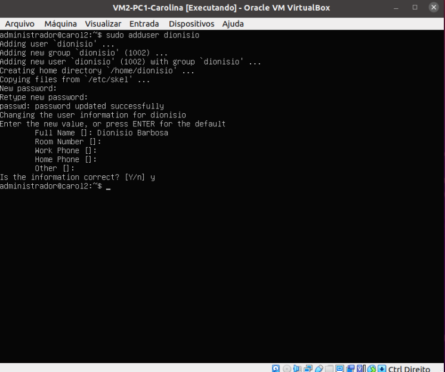
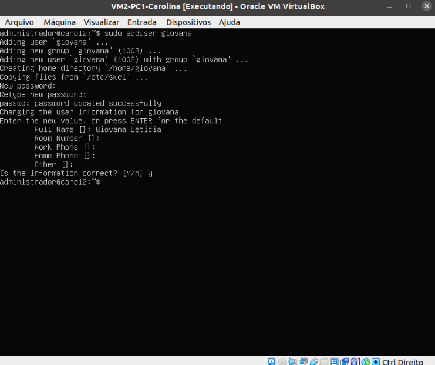
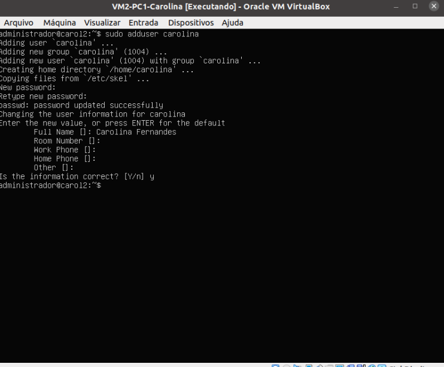
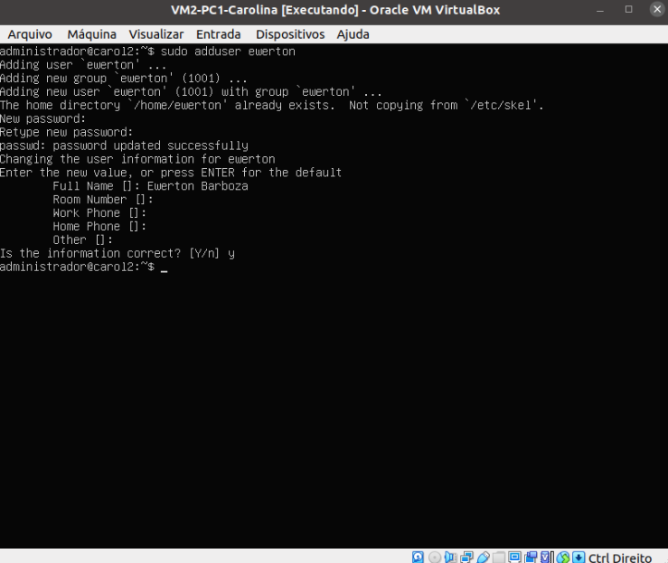
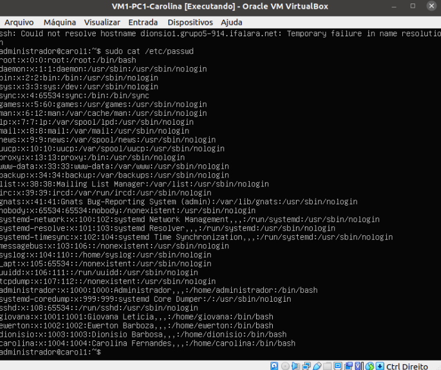
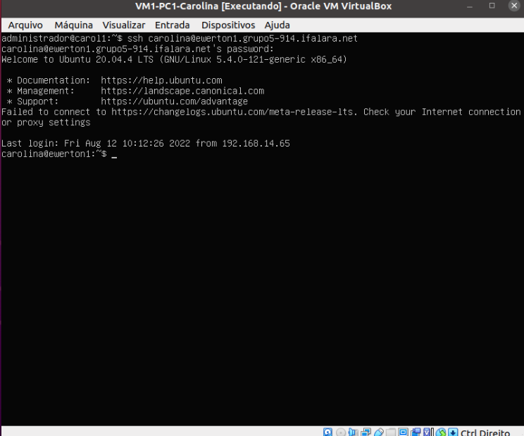

# Projeto 2º Bimestre das disciplinas de Infraestrutura e Serviços de Redes (PRIR/SRED e ISRE)

## Serviço de Nomes Estático

### Passo 1 - Acessar os hospedeiros da máquina

- Utilizar o comando

```bash
$ sudo nano /etc/hosts
```

### Passo 2 - Inserir o endereço IP, Hostname, Domínio e Apelido que estão na tabela de cada membro

<div align="center">
  <p>Figura 1: Configurando os nomes do host estático</p>
  
  <br><br>
</div>

### Passo 3 - Adicionar os usuários para cada VM

- Para realizar essa ação, usa-se o comando:

  ```bash
  $ sudo adduser <Nomeintegrante>
  ```

  - Abaixo estão explicitadas esta inserção:

<br>
<div align="center">
    <p>Figura 2: Inserindo o usuário Dionísio</p>
    
</div>
<br><br>

<div align="center">
    <p>Figura 3: Inserindo o usuário Giovana</p>
    
</div>
<br><br>

<div align="center">
    <p>Figura 4: Inserindo o usuário Carolina</p>
    
</div>
<br><br>

<div align="center">
    <p>Figura 5: Inserindo o usuário Ewerton</p>
    
</div>
<br><br>

### Passo 4 - Verificar os usuários criados

- Para isso utiliza-se o comando:

```bash
$ sudo cat /etc/passwd
```

- Segue a seguir exemplo do uso do comando:

<div align="center">
    <p>Figura 6: Consultando os usuários adicionados</p>
    
</div>
<br><br>

> ## Utilizando o SSH na prática via Domínio

### Passo 1 - Para conectar-se com os usuários de outras máquinas virtuais deve-se utilizar o comando:

```bash
$ ssh <user>@<hostname|fqdn|alias>
```

  <div align="center">
    <p>Figura 7: Acessando o usuário Carolina da VM1 do PC3-Ewerton</p>
    
  </div>

> ## <a href="../README.md">Voltar ao roteiro</a>