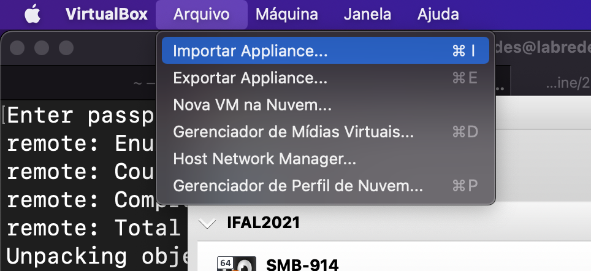
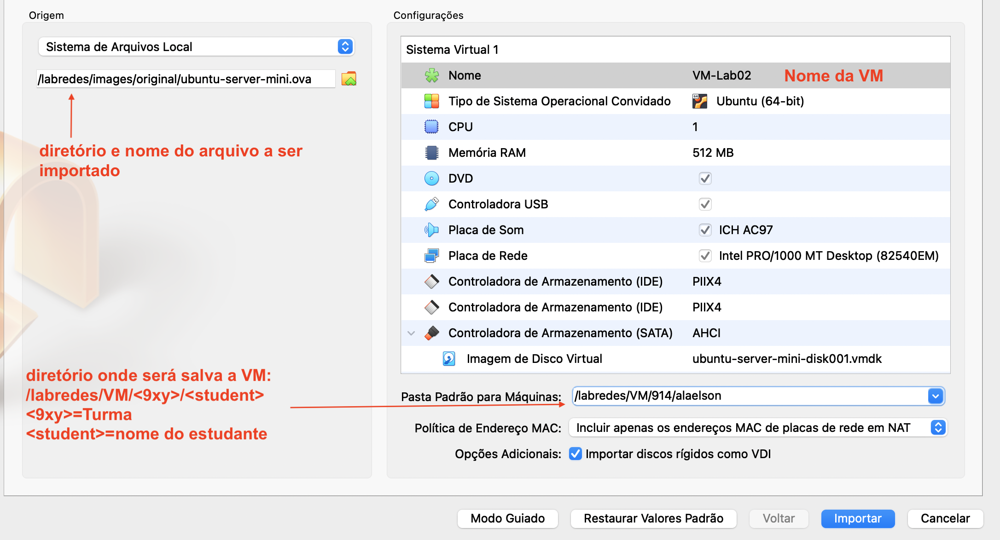

# Projeto 2º Bimestre das disciplinas de Infraestrutura e Serviços de Redes (PRIR/SRED e ISRE)

## Criando Máquinas Virtuais (rede ponto a ponto)

* Verifique a existência do VirtualBox
  - Caso não haja, acesse o link e faça o download: https://www.virtualbox.org/wiki/Downloads


* Configure as interfaces de rede dessas MVs como ilustra a topologia de Rede da figura 1
<p> Figura 1: Topologia de Rede Ponto a Ponto usando o VitualBox, com duas VMs com suas NICs em modo Rede Interna</center></p>   
   

<br>

## Importando VMs no VirtualBox
  * Importe o arquivo .OVA para criar duas VMs
  
  * A Figura 2 Ilustra as configurações para a importação das VMs: VM-LAB01 e VM-LAB02

<p>Figura 2: Criando uma VM apartir de um arquivo OVA</p>   
    
   

* Instale o pacote Net Tools nas VMs
```bash
sudo apt intall net-tools -y
```

  
