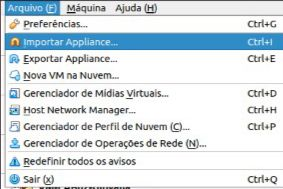
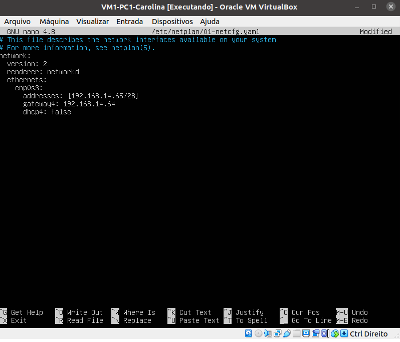
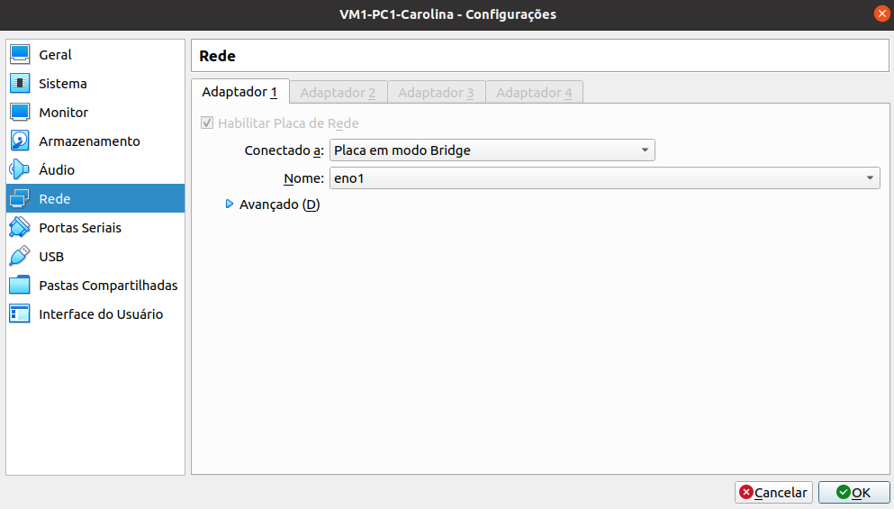

# Projeto 2º Bimestre das disciplinas de Infraestrutura e Serviços de Redes (PRIR/SRED e ISRE)

## Criando Máquinas Virtuais (rede ponto a ponto)


* Configure as interfaces de rede dessas MVs como ilustra a topologia de Rede da figura 1
<p> Figura 1: Topologia de Rede Ponto a Ponto usando o VitualBox, com duas VMs com suas NICs em modo Rede Interna</center></p>   
   

## Importando VMs no VirtualBox
  * Importe o arquivo .OVA para criar duas VMs
  
  * A Figura 2 Ilustra as configurações para a importação das VMs: VM-LAB01 e VM-LAB02

<p>Figura 2: Criando uma VM apartir de um arquivo OVA</p>   
 

   </div>
	


* Instale o pacote Net Tools nas VMs
```bash
sudo apt install net-tools -y
```
## Configure as NICs das VMs

* Selecione as configurações de Rede de cada VM para `rede interna` e defina o nome da rede, por exemplo `<labredes>`

* A Figura 3 ilustra as configurações para a importação das VMs: VM1-PC1-Carolina e VM2-PC1-Carolina 


 <br> 


 ## Fazendo o login nas VMs

   * Abra as duas máquinas virtuais criadas 
   

   * Usuário da VM: `administrador`
   * Senha da VM: `adminifal` 
   

## Configuração estática de endereço IP na interface de rede
  ### Passo 1 - Acesse as interfaces de rede
  * Para configurar a interface, o ubuntu usa o arquivo YAML
  * Digite o comando `ls -la /etc/netplan/` para verificar o nome correto do arquivo no seu servidor.
   > __/etc/netplan/__ é a pasta onde o arquivo se encontra
  * No exemplo abaixo, foi utilizado o arquivo *01-netcfg.yaml*
   
  

### Passo 2 - Edite o arquivo 
  * Para editar o arquivo, digite o comando abaixo:
  ```bash
  $ sudo nano /etc/netplan/01-netcfg.yaml
  ```
  

## Na VM-PC1
  * Após a criação da tabela de Ip's, foi utilizado o IP da Carolina no exemplo: `192.168.14.65`
  ```bash
  network:
    version: 2
    renderer: networkd
    ethernets:
      enp0s3:
        addresses:[192.168.14.65/28]
        gateway4: 192.168.14.64
        dhcp4: false
  ```
   <br>
  
  * Digite `Ctrl + X` para salvar e sair do ambiente de edição do arquivo.
  
  * Após as alterações feitas, digite eo comando **netplan apply** para aplicar as configurações. Depois, veja a configuração das interfaces com o comando **ifconfig -a**

  ```bash
  $ sudo netplan apply
  $ ifconfig -a 
  ```
  

  ## Na VM-PC2
  * Após a criação da tabela de Ip's, foi utilizado o IP da Carolina no exemplo: `192.168.14.66`
  ```bash
  network:
    version: 2
    renderer: networkd
    ethernets:
      enp0s3:
        addresses:[192.168.14.66/28]
        gateway4: 192.168.14.64
        dhcp4: false
  ```
   
  
  * Digite `Ctrl + X` para salvar e sair do ambiente de edição do arquivo.
  
  * Após as alterações feitas, digite eo comando **netplan apply** para aplicar as configurações. Depois, veja a configuração das interfaces com o comando **ifconfig -a**

  ```bash
  $ sudo netplan apply
  $ ifconfig -a 
  ```
  
  
  
  ### Passo 3 - Colocar em modo bridge
   * Conectar os cabos Ethernet nos PCs e configurar a placa de rede para modo Bridge.
   
   
   
#
# Extra
  ### Ping das máquinas
  * Ping da VM1-PC1-Carolina para VM2-PC3-Ewerton
 
 
  ```bash
  $ ping 192.168.14.70
  ```
  
  * Ping da VM1-PC3-Ewerton para VM2-PC1-Carolina
  
  ```bash
  $ ping 192.168.14.66
  ```
  
  > ## <a href="./Etapa 03 - PontoAPonto.md">Próxima etapa<a/>
