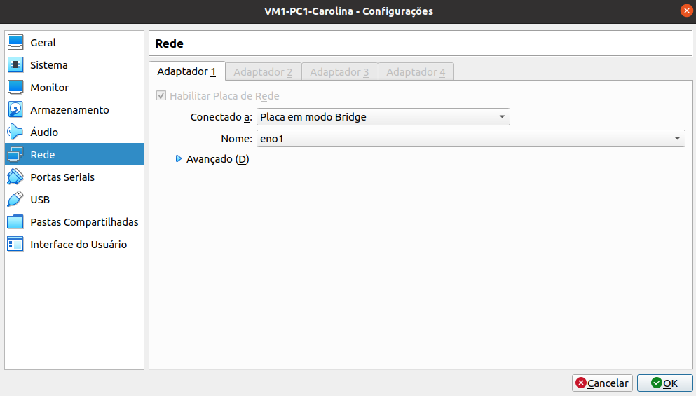
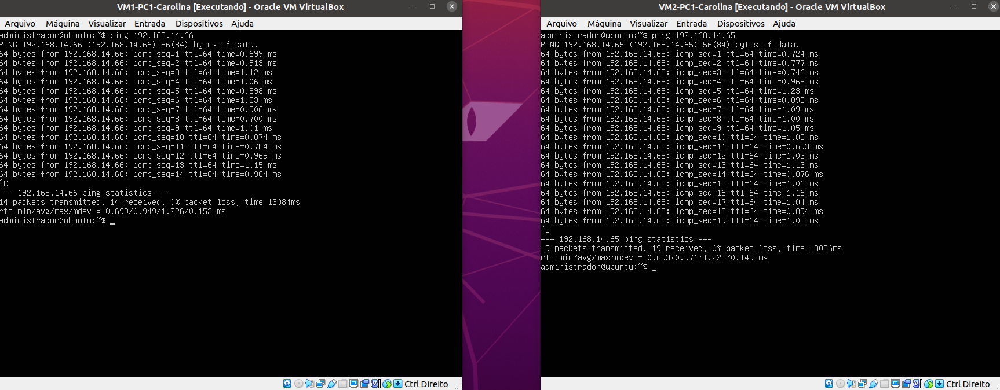

# Projeto 2º Bimestre das disciplinas de Infraestrutura e Serviços de Redes (PRIR/SRED e ISRE)

## Criando uma rede ponto a ponto (Uma LAN com 4 VMs):


  ## Passo 01 - Terminar a prática <a href='https://github.com/diozenio/914-2022-grupo-5/blob/main/Roteiro/Etapa%2002%20-%20CriandoConex%C3%A3oPontoAPonto.md'>Criando Conexão Ponto a Ponto</a>

<br>

  ## Passo 02 - Configuração estática de endereço IP na interface de rede 
```
Tabela 1: Definições de endereços IPs da Rede 
-----------------------------------------
|     DESCRICAO       |       IP        |
-----------------------------------------
| rede                | 192.168.14.0    |
| máscara             | 255.255.255.240 |
| Gateway             | 192.168.14.28   |
| VM1-PC1-Carolina    | 192.168.14.65   | 
| VM2-PC1-Carolina    | 192.168.14.66   |
| VM1-PC2-Dionísio    | 192.168.14.67   |
| VM2-PC2-Dionísio    | 192.168.14.68   |
| VM1-PC3-Ewerton     | 192.168.14.69   |
| VM2-PC3-Ewerton     | 192.168.14.70   |
| VM1-PC4-Giovana     | 192.168.14.71   |
| VM2-PC4-Giovana     | 192.168.14.72   |
-----------------------------------------
```
### Configure o endereço IP de acordo com as suas informações estabelecidas. 
  * Para configurar o endereço IP, acesse <a href='https://github.com/diozenio/914-2022-grupo-5/blob/main/Roteiro/Etapa%2002%20-%20CriandoConex%C3%A3oPontoAPonto.md'>Criando Conexão Ponto A Ponto</a> e vá em **Configuração estática de endereço IP na interface de rede**.

## Configurando a rede `bridge` do VirtualBox nos PCs e nas VMs
  * Abra as configurações de cada VM e mude sua configuraão para `Placa em modo bridge` e seu nome para `eno1`

<div align="center">
  <p>Figura 1: Configuração das NICs como modo `bridge`</p>
  
  <br><br>
</div>

# **EXTRA**

## Teste de conectividade entre as VMs (comando `ping`)
  ### Teste a conexão entre as VMs do mesmo PC
  * Ligue as VMs e faça o login
    * Login `administrador`
    * Senha `adminifal`
      
  > No exemplo abaixo, utilizamos apenas **duas máquinas do mesmo PC** para fazer o teste.
    
  * Para realizar o  comando ping digite o comando `ping` e o IP da máquina desejada
 
  * Ping da VM1-PC1-Carolina para VM2-PC1-Carolina
  ```bash
  ping 192.168.14.66  #ctrl + c para finalizar o comando
  ```
  * Ping da VM2-PC1-Carolina para VM1-PC1-Carolina
  ```bash
  ping 192.168.14.65  #ctrl + c para finalizar o comando
  ```
  
  
 
  ### Teste a conexão entre as VMs de outro PC
  * Para realizar esse teste, certifique que as configurações NICs estão em `Placa modo bridge`
  * Certifique que as VMs do outro PC, cujo IP deseja usar o comando ping estejam ligadas
  * Adquira o **Ethernet** e conecte entre os PCs

    
    
    <br>

  * Ping da VM1-PC1-Carolina para VM2-PC3-Ewerton
 
  ```bash
  $ ping 192.168.14.70
  ```
  
  * Ping da VM1-PC3-Ewerton para VM2-PC1-Carolina
  
  ```bash
  $ ping 192.168.14.66
  ```
  

  <br>
	
 > ## <a href="./Etapa 04 - AcessoRemoto.md">Próxima etapa<a/>   
