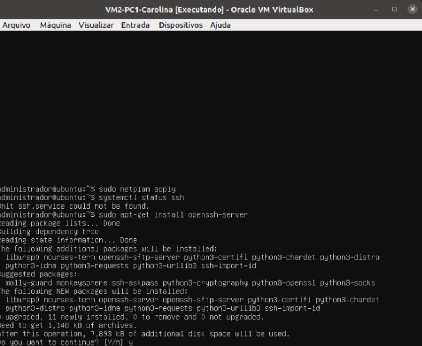
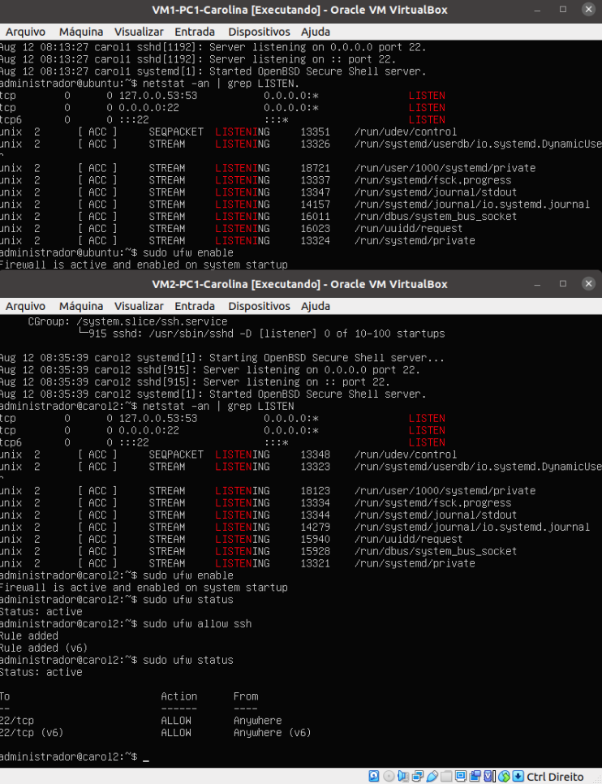
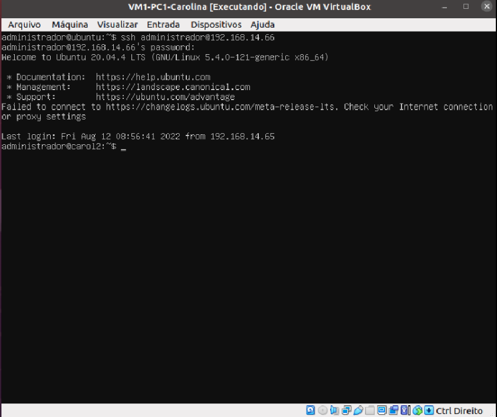

# Roteiro: Acesso remoto em outras máquinas
## 1 - Configurando o hostname
- Com a máquina ligada, crie um novo hostname com o comando

```bash
$ sudo hostnamectl set-hostname nome-do-hostname
```
<div align="center">
  <p>Figura 1 - Exemplo de criação de um novo hostname</p>
  
  <br><br>
</div>

<div align="center">
  <p>Figura 2 - Verificando o hostname</p>
  
  <br><br>
</div>

## 2 - Conectando a máquina à internet

- Caso a máquina não esteja conectada à internet, siga os passos: 
  - Confira se as máquinas estão utilizando o Adaptador1 no modo NAT 
  - Abra o arquivo de configuração do Netplan utilizando o nano com o comando


```bash
$ sudo nano /etc/netplan/01-netcfg.yaml
```

- Comente as linhas de IP estático e ativo o DHCP4

```bash
network:
    ethernets:
            # addresses: [172.17.0.1/24]
            # gateway4: 172.17.0.1
            dhcp4: true
    version: 2
```

- Aplique as alterações feitas

```bash
$ sudo netplan apply
$ ifconfig -a
```

- Teste se suas máquinas estão conectadas à internet com o comando

```bash
$ ping www.google.com
```
<div align="center">
  <p>Figura 3 - Verificando o conexão de internet com o comando ping</p>
  
  <br><br>
</div>

## 3 - Instalando o SSH Server

```bash
$ sudo apt-get install openssh-server
```

- Digite "Y" para confirmar a instalação como no exemplo a seguir

<div align="center">
  <p>Figura 4 - Instalação do SSH Server</p>
  
  <br><br>
</div>

- Verifique o status do ssh para saber se a instalação foi concluída com sucesso

```bash
$ systemctl status ssh
```

<div align="center">
  <p>Figura 5 - Status do SSH Server</p>
  
  <br><br>
</div>

## 4 - Configurando o Firewall

- Permita a conexão remota via protocolo SSH na porta 22, utilizando o comando 

```bash
$ sudo ufw allow ssh.  
```

- Ative o firewall

```bash
$ sudo ufw enable
```

<div align="center">
  <p>Figura 6 - Ativação do firewall</p>
  
  <br><br>
</div>

<section id="ssh"> </section>

## 5 - Acessando uma máquina remotamente 


- Configure o Netplan para o modo brigde novamente e aplique as alterações 
- Conecte os computadores utilizando cabos de rede
- Utilize o comando $ ssh ``<usuario>``@``<ip.do.servidor.remoto>`` para acessar remotamente uma outra máquina

<div align="center">
  <p>Figura 7 - Acessando máquinas remotamente pelo ssh server</p>
  
  <br><br>
</div>

## 6 - Acessando remotamente a máquina de um computador externo

- Conecte os cabos de rede de um computador para o outro
- <a href="#ssh">Acesse a máquina deseja seguindo os passos de conexão com SSH</a>

<div align="center">
  <p>Figura 8 - Acessando uma máquina de outro computador via cabo de rede</p>
  
  <br><br>
</div>

  > ## <a href="./Etapa 05 - HostOnly.md">Próxima etapa<a/>