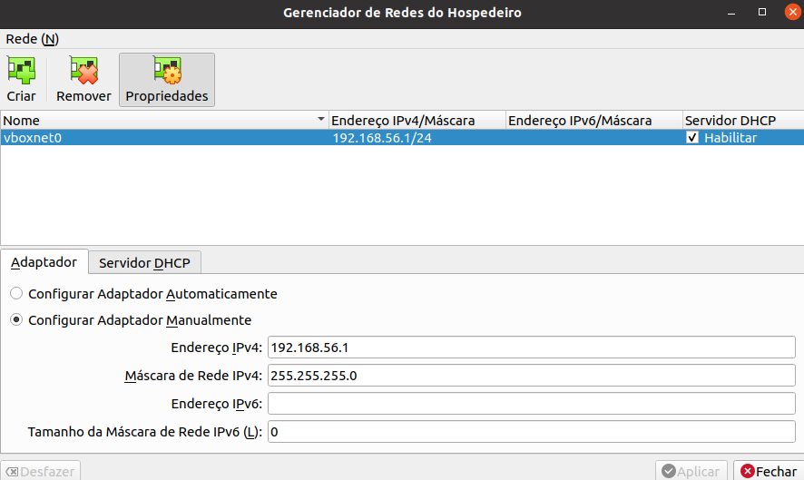
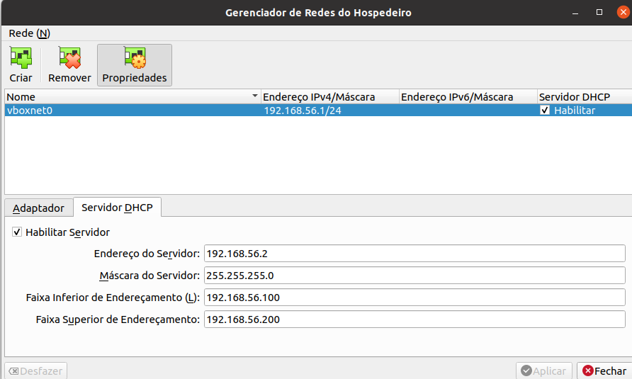
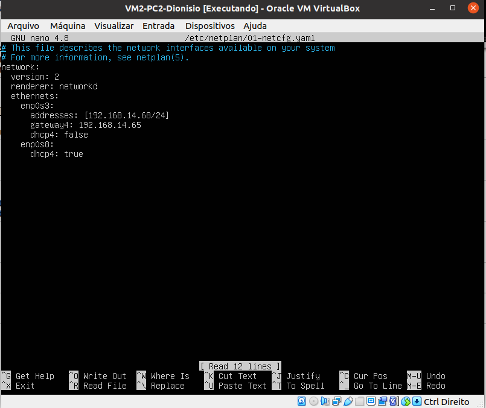
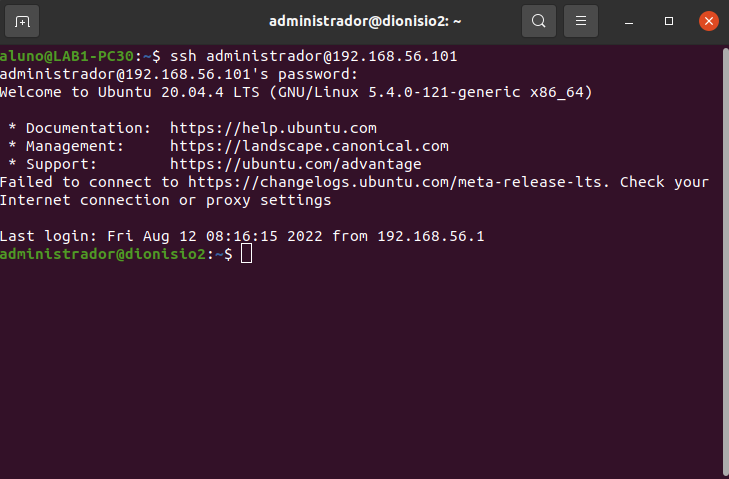
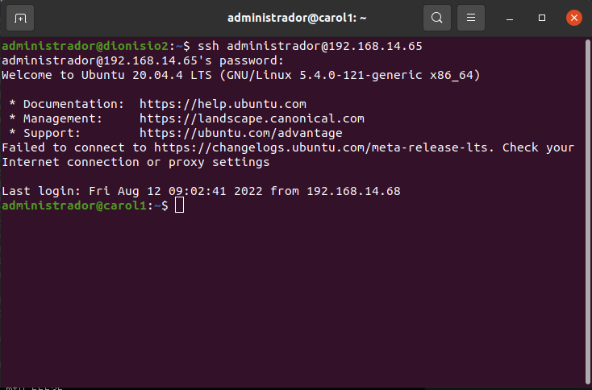

# Acesso Remoto SSH com (Host Only) no Virtual Box
## 1 - Criando comunição entre o pc HostOnly
- Abra o Virtual Box 
- Clique em ``Arquivo``->``Host Network Manager``


<div align="center">
  <p>Figura 1 - Configurando o adaptador vboxnet0</p>
  
  <br><br>
</div>

<div align="center">
  <p>Figura 2 - Configurando o DHCP4 do adaptador vboxnet0</p>
  
  <br><br>
</div>

## 2 - Configurando a VM Hostonly
- Abra as configurações de rede da VM HostOnly

<div align="center">
  <p>Figura 3 - Configurando o adaptador 2 na VM</p>
  
  <br><br>
</div>

## 3 - Ativando as configurações na VM  
- Configure as interfaces no netplan

```bash
$ sudo nano /etc/netplan/01-netcfg.yaml
```

<div align="center">
  <p>Figura 4 - Configurando netplan</p>
  
  <br><br>
</div>

- Ative as alterações na configuração

```bash
$ sudo netplan apply
```

## 4 - Acessando a VM Hostonly
- No terminal do computador, utilize o seguinte comando para acessar a VM 

```bash
$ ssh administrador@192.168.56.101
```

<div align="center">
  <p>Figura 5 - Acessando a VM 2</p>
  
  <br><br>
</div>

## Extra - Acessando outra VM a partir do HostOnly
- <a>Conecte o cabo de rede entre os computadores da conexão</a>
- Verifique se ambos as VMs estão com o adaptador 1 configurado no modo Brigde
- Use o comando de acesso ssh utilizando o ip de destino

```bash
$ ssh administrador@<ip.da.vm.destino>
```

<div align="center">
  <p>Figura 6 - Acessando a VM do outro computador conectado</p>
  
  <br><br>
</div>

  > ## <a href="./Etapa 07 - ServiçoDeNomesEstáticos.md">Próxima etapa<a/>
