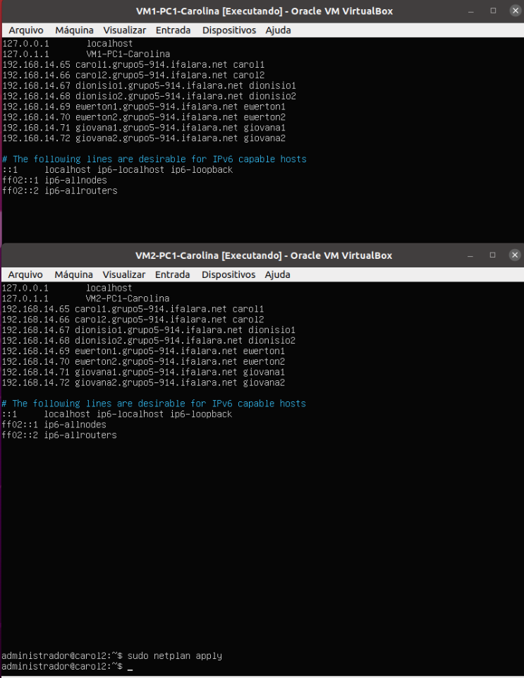
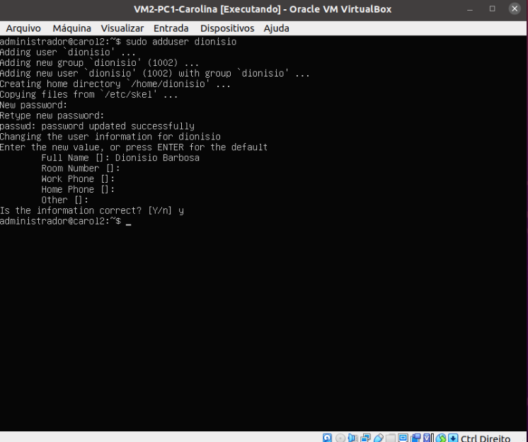
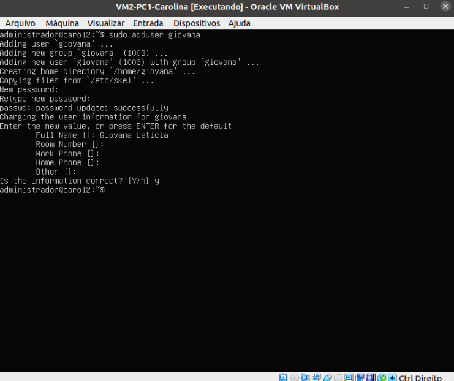
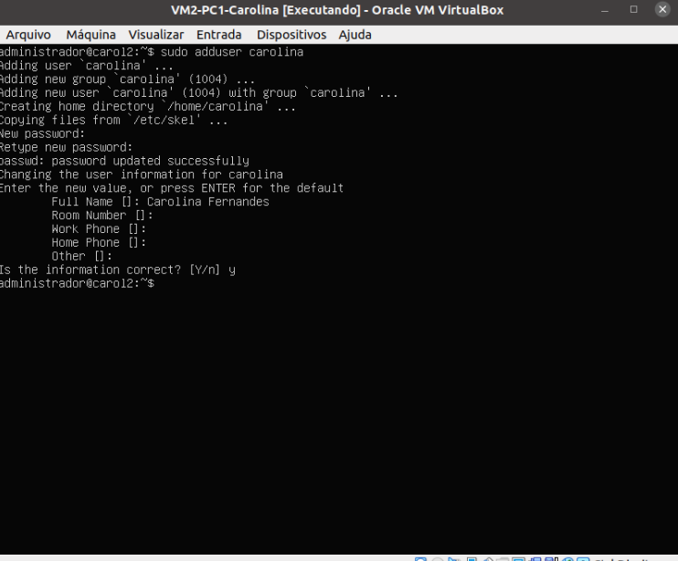
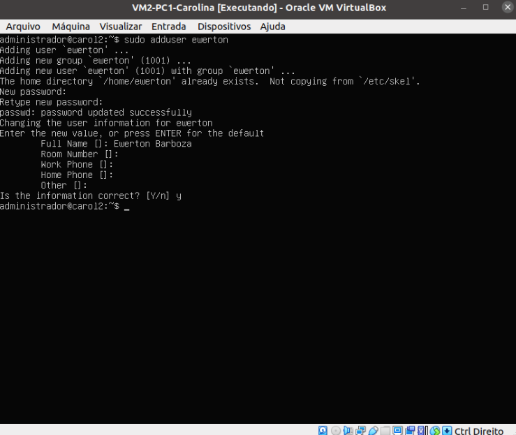
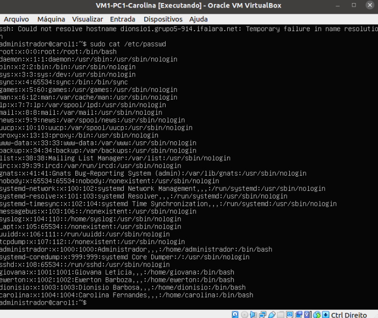
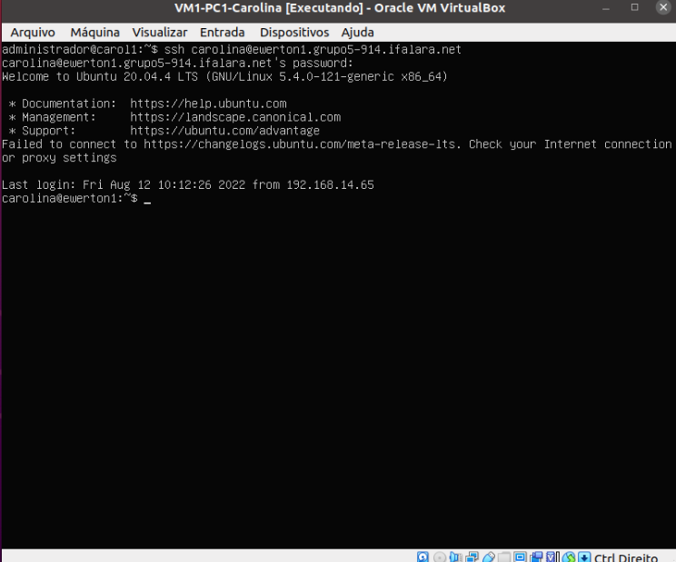

# Projeto 2º Bimestre das disciplinas de Infraestrutura e Serviços de Redes (PRIR/SRED e ISRE)

## Serviço de Nomes Estático

### Passo 1 - Acessar os hospedeiros da máquina

- Utilizar o comando

```bash
$ sudo nano /etc/hosts
```

### Passo 2 - Inserir o endereço IP, Hostname, Domínio e Apelido que estão na tabela de cada membro


<p>Figura 1: Configurando os nomes do host estático</p>
	
* Faz-se necessário inserir em cada VM tais dados, afim de utilizar o comando:
	
	```bash
	$ ssh <user>@<hostname|fqdn|alias>
	```
	### Passo 3 - Inserir os usuários de todos os membros
	
	* Para realizar essa ação, usa-se o comando:
	
	```bash
	$ sudo adduser <Nomeintegrante>
	```
	
	* Abaixo estão explicitadas esta inserção:
	
	
	<p>Figura 2: Inserindo o usuário Dionísio</p>
	
	
	<p>Figura 3: Inserindo o usuário Giovana</p>
	
	
	<p>Figura 4: Inserindo o usuário Carolina</p>
	
	
	<p>Figura 5: Inserindo o usuário Ewerton</p>
	
	### Passo 4 - Verificar os usuários criados
	
	* Para isso utiliza-se o comando:
	
	```bash
	$ sudo cat /etc/passwd
	```
	
	* Segue a seguir exemplo do uso do comando:
	
	
	<p>Figura 6: Consultando os usuários adicionados</p>
	
	## Utilizando o SSH na prática via Domínio
	
	### Passo 1 - Para conectar-se com os usuários de outras máquinas virtuais deve-se utilizar o comando:
	
	```bash
	$ ssh <NomeDoUsuario>@<hostname|fqdn>
	```
	
	<p>Figura 7: Acessando o usuário Carolina da VM1 do PC3-Ewerton</p>
	
	<br>
	
	> ## <a href="https://github.com/diozenio/914-2022-grupo-5">Voltar ao início<a/>  
