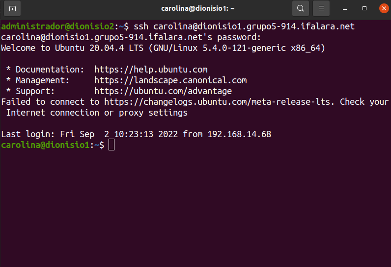
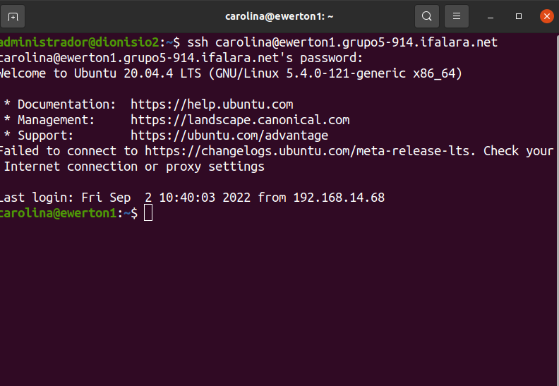
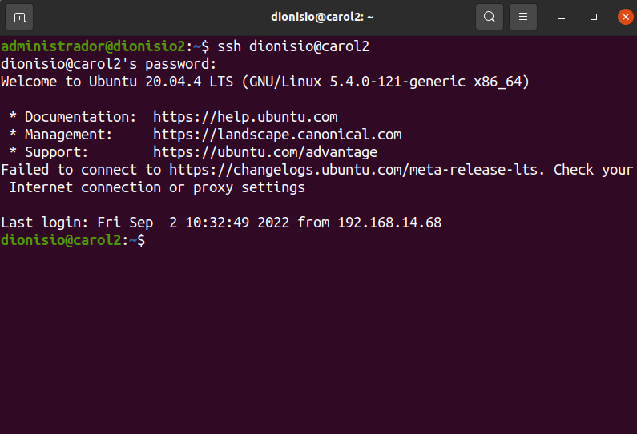
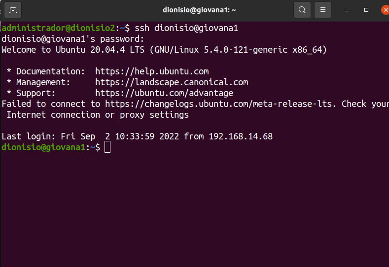
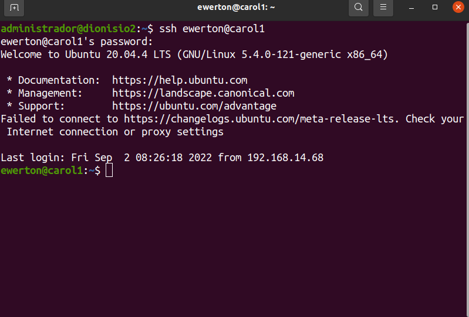
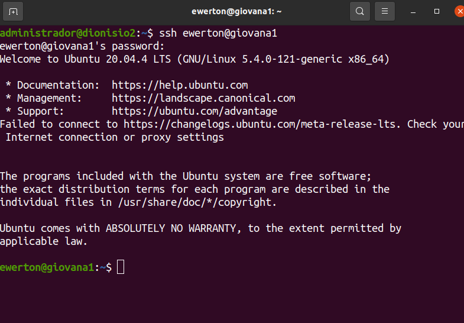
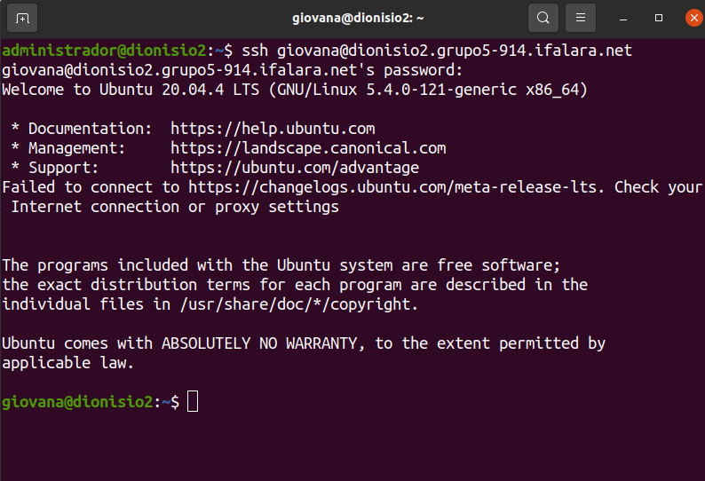
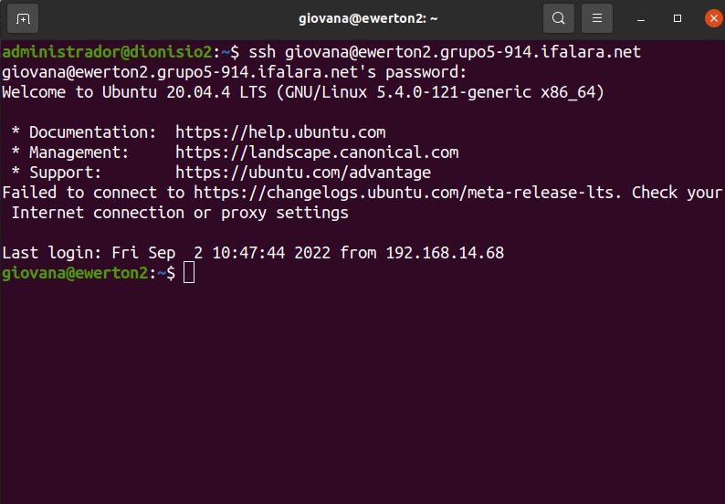

# Roteiro: Testando o acesso remoto entre as máquinas e computadores

  
Figura 1 - Acessando o domínio da VM 1 do Dionísio com o usuário Carolina

  
    

.

  
Figura 2 -  Acessando o domínio da VM 1 do Ewerton com o usuário Carolina

  
    

.

  
Figura 3 - Acessando o usuario X da VM X da pessoa X

  
    

.

  
Figura 4 - Acessando o usuario X da VM X da pessoa X

  
    

.

  
Figura 5 - Acessando o usuario X da VM X da pessoa X

  
    

.

  
Figura 6 - Acessando o usuario X da VM X da pessoa X

  
    

.

  
Figura 7 - Acessando o domínio da VM 2 do Dionísio com o usuário Giovana

  
    

.

  
Figura 8 - Acessando o domínio da VM 2 do Ewerton com o usuário Giovana

  
    

.

## <a href="../README.md">Voltar ao roteiro</a>